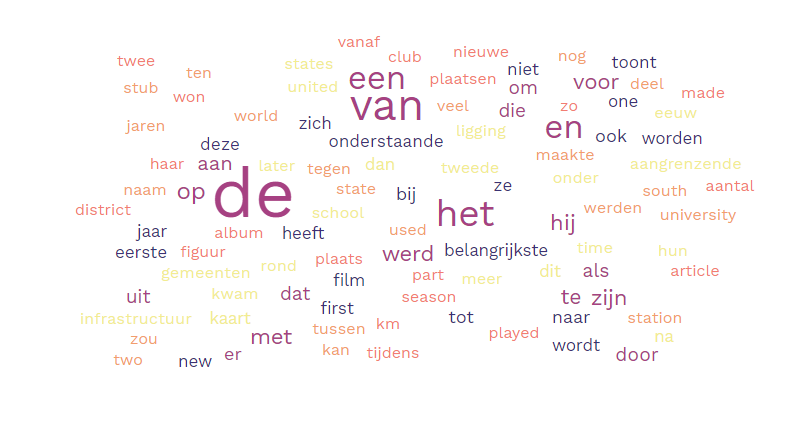

# **Wikipedia Language Classifier**
### *Maksim Pikovskiy*
#### *CSCI-331: Introduction to Artificial Intelligence*
#### *4/13/2022*

### **Table of Contents**
* [Usage](#usage)
  * [Example Usage](#usage-example)
* [Best Models](#best)
  * [Example Training/Testing Files](#example)
* [Decision Tree](#decision-tree)
* [AdaBoost](#adaboost)
* [Attributes](#attributes)
* [Wrong Classifications and Error Rate (AdaBoost)](#wrong) 

Wikipedia Language Classifier is a program that distinguishes example 
sentence between two languages: English and Dutch. It uses Decision Tree
and Adaboost algorithms to classify given examples. This Classifier uses
a dictionary of attributes for its decision.

### Usage 
Place your desired training and testing data files into `lab3/input` folder. After training
the Classifier, it will generate object file with the given output file name in `lab3/output`
directory.

* `python lab3.py train <examples> <hypothesisOut> <learning-type>` to read the labeled examples and perform training ("ada" or "dt").
  * `examples` is a file containing labeled examples.
  * `hypothesisOut` specifies the file name to write your model to.
  * `learning-type` specifies the type of learning algorithm you want to run, it is either "dt" or "ada". 
    * *You can edit the desired `DEPTH` and `ENSEMBLE_SIZE` in `lab3.py` file.*
* `python lab3.py predict <hypothesis> <file>` to classify each line as either English or Dutch using the specified hypothesis.
  * `hypothesis` is a trained decision tree or ensemble created by the classifier
    * *It will be in `lab3/output` directory. Simply put the name of the file and it will read it from directory*
  * `file` is a file containing lines of 15 word sentence fragments in either English or Dutch.

#### Example Usage 
> *Remember to place the testing and training data files into `lab3/input` directory.*

Train an AdaBoost model:
* `python lab3.py train main_train.dat ensemble.oj ada`

Let AdaBoost model predict the classifications of sentences in test data file:
* `python lab3.py predict ensemble.oj main_test.dat`

Train a Decision Tree model:
* `python lab3.py train main_train.dat tree.oj dt`

Let Decision Tree model predict the classifications of sentences in test data file:
* `python lab3.py predict tree.oj main_test.dat`
 
### Best Models 
The best models for ensemble and decision tree are in the `lab3/output`:
* `ensemble.oj` which is the best model trained under AdaBoost.
* `tree.oj` which is the best model trained under Decision Tree.

Both models were generated using the `main_train.dat` file. This is the file of either English or Dutch with 
corresponding labels. It was provided by Jake Waclawski. The original train data file contained 1000 English 
and 1000 Dutch examples.

#### Example Training/Testing Files 
The original training data file, provided by Jake Waclawski, was split using a 70%-30% rule of databases. That is,
70% of the examples (1400 sentences out of 2000 sentences) were used as a training data, which is currently contained
in `main_train.dat` file. The rest of the examples, 30%, (600 sentences out of 2000 sentences) was used as a testing,
which is contained in `main_test.dat` file.

### Decision Tree 
The Decision Tree Training/Testing Model was implemented using the pseudocode from "Artificial Intelligence: A 
Modern Approach (Fourth Edition)" by Stuart Russell and Peter Norvig. However, there was a slight change in the 
algorithm, which is adding depth to the algorithm. The parameter depth determines the maximum depth the Decision Tree
can grow. The Best Decision Tree was trained on `main_train.dat` (1400 examples) and tested on `main_test.dat` 
(600 examples). By changing the `DEPTH` value in `lab3.py`, it was found that a minimum depth of 7 is required to
nearly perfectly classify the data (only 2/600 examples were wrong, error rate of 0.33%).  

With depth 8, the Decision Tree Model only incorrectly classified 2 examples out of 600.  
&emsp;&emsp; Thus, the error rate would be: 1/600 = 0.0017% = 0.17%  
&emsp;&emsp; The accuracy is 99.83%   
Increasing depth past 8 does not seem to lower the error rate.  

### AdaBoost 
The AdaBoost Training/Testing Model was implemented using the pseudocode from "Artificial Intelligence: A 
Modern Approach (Fourth Edition)" by Stuart Russell and Peter Norvig. There is no deviation from the pseudocode.
The learning algorithm chosen was the Decision Tree. The parameter ensemble size determines the maximum ensemble size 
of the AdaBoost. The Best AdaBoost Model was trained on `main_train.dat` (1400 examples) and tested on `main_test.dat` 
(600 examples). Each stump in ensemble was a Decision Tree with maximum depth of 1. By changing the `ENSEMBLE_SIZE` 
valued in `lab3.py`, it was found that a minimum ensemble size of 10 is required to nearly perfectly classify the 
data (only 8/600 examples were wrong, error rate of 1.33%).

With ensemble size of 10, the AdaBoost Model only incorrectly classified 8 examples out of 600.  
&emsp;&emsp; Thus, the error rate would be: 8/600 = 0.0133 = 1.33%   
&emsp;&emsp; The accuracy is 98.67%  
Increasing ensemble size past 10 does not seem to lower the error rate.  

Furthermore, it is interesting that Decision Tree was more accurate than the AdaBoost, implementing Decision Tree.
This could be accounted to a maximum depth of 1 for each stump, which has a higher chance of error.

### Attributes 
To get the attributes to classify the language of Examples, I have observed the original `train.dat` file, which
was provided by Jake Waclawski. I have noticed the patterns, such as vowel pairs for Dutch language ("aa" and "ee") and 
consonant pairs for English language ("tt" and "cc"). Furthermore, I noticed the significant use of specific words and 
articles (like "de", "van", "the", "of", "with", etc). To further prove my observations, I used an online tool to confirm
my observations. The tool generates the word cloud graph, where larger words appear more than smaller ones. The tool can
be found here: https://www.freewordcloudgenerator.com/generatewordcloud. Furthermore, some other general 
features/attributes were used, like average word length (made from observation that Dutch word appear in smaller length
compared to English words), "vowel pairs to consonant pairs" ratio, and more.

Other additional material was used to determine function words between the Dutch and English languages:
* English Function Words: https://github.com/Yoast/javascript/blob/develop/packages/yoastseo/src/researches/english/functionWords.js
* Dutch Function Words: https://github.com/Yoast/javascript/blob/develop/packages/yoastseo/src/researches/dutch/functionWords.js

#### Word Cloud For 2000 Train Data

There are **37 chosen attributes**, of which there are **16 attributes specifically for Dutch** and **16 attributes specifically 
for English**. The other **5 are more general observations**. 32 attributes are binary and the other are 3-4 specific ranges 
for each one.

| Attribute | Description | Explanation |
| --------- | ----------- | ----------- |
| **Dutch Attributes** |
| ends-in-en | (Binary) True if there is any word than ends in en | a lot of Dutch words end in "end" |
| has-aa | (Binary) True if there is "aa" vowel pair | a lot of Dutch words seem to have the "aa" vowel pair |
| has-ee | (Binary) True if there is "ee" vowel pair | a lot of Dutch words seem to have the "ee" vowel pair |
| has-word-zijn | (Binary) True if there is a word "zijn" | there was a relatively heavy presence of "zijn" in 2000 examples |
| has-word-en | (Binary) True if there is a word "en" | there was a high presence of "en" in the 2000 examples, seen in word cloud above |
| has-article-de | (Binary) True if there is an article "de" | there was a high presence of "de" in 2000 examples and it is an Dutch article |
| has-article-het | (Binary) True if there is an article "het" | there was a high presence of "het" in 2000 examples and it is an Dutch article |
| has-article-een | (Binary) True if there is an article "een" | there was a somewhat high presence of "een" in 2000 examples and it is an Dutch article |
| has-article-der | (Binary) True if there is an article "der" | "der" is a common Dutch article, which could definitely be written in any online article |
| has-article-des | (Binary) True if there is an article "des" | "des" is a common Dutch article, which could definitely be written in any online article | 
| has-article-den | (Binary) True if there is an article "den" | "den" is a common Dutch article, which could definitely be written in any online article | 
| has-word-van | (Binary) True if there is an article "van" | "van" is a common Dutch preposition and has a high presence in 200) examples | 
| has-word-voor | (Binary) True if there is a word "voor" | there is a decent presence of "voor" in 2000 examples |
| has-word-werd | (Binary) True if there is a word "werd" | there is a decent presence of "werd" in 2000 examples |
| has-word-op | (Binary) True if there is a word "op" | there is a decent presence of "op" in 2000 examples |
| has-word-uit | (Binary) True if there is a word "uit" | there is a decent presence of "uit" in 2000 examples |
| **English Attributes** |
| has-word-she | (Binary) True if there is a word "she" | "she" is a common pronoun used in English writing |
| has-word-he | (Binary) True if there is a word "he" | "he" is a common pronoun used in English writing |
| has-word-they | (Binary) True if there is a word "they" | "they" is a common pronoun used in English writing |
| has-word-it | (Binary) True if there is a word "it" | "it" is a common pronoun used in English writing |
| has-word-him | (Binary) True if there is a word "him" | "him" is a common pronoun used in English writing |
| has-word-her | (Binary) True if there is a word "her" | "her" is a common pronoun used in English writing |
| has-word-them | (Binary) True if there is a word "them" | "them" is a common pronoun used in English writing |
| has-article-the | (Binary) True if there is an article "the" | article "the" is heavily used in English writing |
| has-article-a | (Binary) True if there is an article "a" | article "a" is heavily used in English writing |
| has-article-an | (Binary) True if there is an article "an" | article "an" is heavily used in English writing |
| has-word-and | (Binary) True if there is a word "and" | "and" is a common conjunction in English writing |
| has-word-or | (Binary) True if there is a word "or" | "or" is a common conjunction in English writing |
| has-word-of | (Binary) True if there is a word "of" | "of" is a common preposition in English writing |
| has-word-with | (Binary) True if there is a word "with" | "with" is a common preposition in English writing |
| has-word-within | (Binary) True if there is a word "within" | "within" is a relatively common preposition in English writing |
| has-word-by | (Binary) True if there is a word "by" | "by" is a common preposition in English writing |
| **General Attributes** | 
| vow_con_ratio | (Range) range for "vowel pairs to consonant pairs" ratio | Dutch language seems to exhibit more vowel pairs compared to English language|
| avg_word_len | (Range) range for average word length in the example | Dutch language seems to have words in smaller length compared to English language |
| vowel-pairs | (Range) range for vowel pairs in the example | Dutch language seems to exhibit more vowel pairs |
| consonant-pairs | (Range) range for consonant pairs in the example | English language seems to exhibit more consonant pairs |
| letter-pairs | (Range) range for the count of letter pairs (vowel and consonant) | Dutch language has significantly more letter pairs than English language |

Two attributes were removed from evaluations as both languages seemed to use the attributes in same amount:
* `ends-in-e` because a lot of both, Dutch and English, words end in "e" 
* `has-word-in` because both, Dutch and English, languages use this preposition

### Wrong Classifications and Error Rate (AdaBoost) 

Wrongly Classified Examples for `main_test.dat` using AdaBoost model with ensemble size of 5:  
Out of 600 examples, only 23 examples were classified wrong.   
Thus, the error rate would be: 23/600 = 0.0383 = 3.83%   
The accuracy is 96.17%

Format: `Result | Actual | Line`
* en|nl|Vanaf de vierde aflevering ging het programma de kijkcijferlift in er trok het ruim 770
* en|nl|In 2006 is het aantal inwoners door het United States Census Bureau geschat op 35
* en|nl|Tegenwoordig staat hij onder contract bij het uit New York afkomstige Jazz label Bethlehem Records
* nl|en|Admiral Chegwidden tries in vain to get a plane to Italy to see his daughter
* nl|en|He was especially fond of Allen Iverson and was also a fan of Kobe Bryant
* en|nl|Het boek werd nog tot de 18e eeuw gebruik als leerboek voor de Armeense geschiedenis
* en|nl|The Weight Is a Gift is het vierde studioalbum van de Amerikaanse band Nada Surf
* en|nl|Wiske komt er in het archief achter dat Theofiel degene is die het waanzinvirus verspreidt
* nl|en|Auden was a major poet who had a similar influence on subsequent poets as W
* en|nl|Dijkstal bestreed echter dat Wilders door de VVD in zijn vrije meningsuiting zou zijn beperkt
* nl|en|Tandy updated his frontispiece to a plain pen and ink drawing for printings after 1943
* en|nl|In 2006 is het aantal inwoners door het United States Census Bureau geschat op 11
* nl|en|They have since been upgraded to HC5 standard with a digital automated flight control system
* en|nl|In 2006 is het aantal inwoners door het United States Census Bureau geschat op 18
* nl|en|This is used when encryption is not a practical solution or in tandem with encryption
* nl|en|Community central heating systems have been existing for many decades in regions of cold winters
* en|nl|Vanaf de bouw in 1948 tot 1976 was het de telescoop met de grootste spiegel
* nl|en|This sequence of scales is then used for creating a melody or improvising a solo
* nl|en|He had been of special help to them all in applying Christianity to social questions
* nl|en|Production and product research had started with 10 men at a small works in Millwall
* en|nl|Lee dat hij Noordelijke Army of the Potomac in een snel tempo oprukte door Maryland
* en|nl|In 1999 speelde ze in The Green Mile en in 2002 in Far from Heaven
* nl|en|On occasions they have produced live broadcasts which have been shown in various Guernsey locations

By increasing the ensemble size to 7, the error rate decreased:   
Error Rate: 10/600 = 0.0167 = 1.67%   
The accuracy is 98.33%

Format: `Result | Actual | Line`
* nl|en|Admiral Chegwidden tries in vain to get a plane to Italy to see his daughter
* nl|en|Auden was a major poet who had a similar influence on subsequent poets as W
* nl|en|They have since been upgraded to HC5 standard with a digital automated flight control system
* nl|en|This is used when encryption is not a practical solution or in tandem with encryption
* nl|en|Community central heating systems have been existing for many decades in regions of cold winters
* nl|en|This sequence of scales is then used for creating a melody or improvising a solo
* nl|en|He had been of special help to them all in applying Christianity to social questions
* en|nl|Lee dat hij Noordelijke Army of the Potomac in een snel tempo oprukte door Maryland
* en|nl|In 1999 speelde ze in The Green Mile en in 2002 in Far from Heaven
* nl|en|On occasions they have produced live broadcasts which have been shown in various Guernsey locations

By further increasing the ensemble size to 10, the error rate decreased, but has platoed:  
Error Rate: 8/600 = 0.0133 = 1.33%   
The accuracy is 98.67%

Format: `Result | Actual | Line`
* nl|en|Huvaa is a Maldivian romantic drama web television series developed for Baiskoafu by Fathimath Nahula
* nl|en|Auden was a major poet who had a similar influence on subsequent poets as W
* en|nl|Remember the Night is een Amerikaanse romantische film uit 1940 onder regie van Mitchell Leisen
* nl|en|They have since been upgraded to HC5 standard with a digital automated flight control system
* nl|en|This is used when encryption is not a practical solution or in tandem with encryption
* nl|en|Community central heating systems have been existing for many decades in regions of cold winters
* nl|en|This sequence of scales is then used for creating a melody or improvising a solo
* nl|en|On occasions they have produced live broadcasts which have been shown in various Guernsey locations
